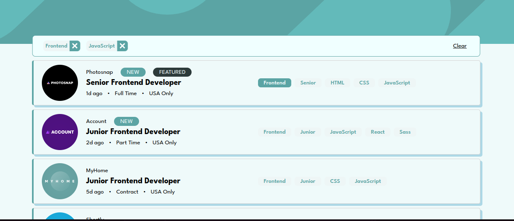

# Frontend Mentor - Job listings with filtering solution

This is a solution to the [Job listings with filtering challenge on Frontend Mentor](https://www.frontendmentor.io/challenges/job-listings-with-filtering-ivstIPCt).

## Table of contents

- [Frontend Mentor - Job listings with filtering solution](#frontend-mentor---job-listings-with-filtering-solution)
  - [Table of contents](#table-of-contents)
  - [Overview](#overview)
    - [The challenge](#the-challenge)
    - [Screenshot](#screenshot)
    - [Links](#links)
  - [My process](#my-process)
    - [Interfaces](#interfaces)
    - [State management](#state-management)
    - [Components](#components)
      - [`Component.ts`](#componentts)
      - [`Button.ts`](#buttonts)
      - [`RenderFilter.ts`](#renderfilterts)
      - [`RenderJobList.ts`](#renderjoblistts)
      - [`JobItem.ts`](#jobitemts)
      - [`RenderHeader.ts`](#renderheaderts)
      - [`RenderFooter.ts`](#renderfooterts)
    - [Built with](#built-with)
    - [](#)
    - [What I learned](#what-i-learned)
    - [Continued development](#continued-development)
  - [Author](#author)

**Note: Delete this note and update the table of contents based on what sections you keep.**

## Overview

### The challenge

Users are able to:

- View the optimal layout for the site depending on their device's screen size
- See hover states for all interactive elements on the page
- Filter job listings based on the categories

### Screenshot



### Links

- Solution URL: [Solution in github](https://github.com/Thanos-M11/job-listing-typescript)
- Live Site URL: [in progress...]()

## My process

The whole approach is completely object oriented. The whole idea is to design skeleton templates and use clean and dry code to instanciate objects according to the operation as show in the `app.ts`

```typescript
// app.ts
import { RenderHeader } from "./components/RenderHeader.js";
import { RenderFooter } from "./components/RenderFooter.js";
import { RenderJobList } from "./components/RenderJobList.js";
import { RenderFilter } from "./components/RenderFilter.js";
import { filterState } from "./state/filterState.js";
import { jobState } from "./state/jobState.js";

function App() {
  new RenderHeader();
  new RenderFilter(filterState);
  new RenderJobList(jobState, filterState);
  new RenderFooter();
}

App();
```

### Interfaces

- created two main interfaces `Filter` and `Job` under `models`

### State management

- created two `state` classes that is the `filterState` and the `jobState`
  - both `states`:
    - are singleton (have a private constructor)
    - have a `listener` array
    - have an `addListener` function
    - have a `notifyListener` function
    - have a getter and a setter function.
  - the `filterState`:
    - has also a `clearFilter` fn and an `isEmpty` fn that checks two params and returns `true` or `false` if the filter is empty or not.
  - the `jobState` :
    - has also a `getFilteredJobs` fn to return an array of jobs according to a `filter`.

### Components

#### `Component.ts`

`Component` is an abstract generic class with a main functionality to render a template under a host.

- It receives:

  - a `templateId`
  - a `hostElementId`
  - a `insertAtStart` boolean param and
  - a `clonedElementId`

- It clones in memory the first child of the template content.
- It assigns an `id` in the `clonedElement`
- It uses the `attach` fn to insert the clonedElement to the `hostElement`.

#### `Button.ts`

This `button` component is a flexible `button`

1. It receives:

- `hostId`
- `content`
- `className`
- `handlerFn` callback function for a `click` event
- `feature` which categorises the button
- `removeWrapper` which is a boolean prop to be used to wrap the button with a remove icon.

2. It adds an event listener and binds the handler function
3. Runs the `renderRemoveWrapper` fn if the equivalent boolean `removeWrapper` is `true`
4. Adds the styling class to the button element
5. Sets the content of the element
6. attaches the button to the host

#### `RenderFilter.ts`

- Inherits the `Component` class
- adds a listener to the `FilterState` class and renders the filters according to the filter state by instantiating a new button component for every filter type.
- The filter bar is rendered if the filter is not empty.

#### `RenderJobList.ts`

- Inherits the `Component` class
- adds a listener to the `FilterState` class and a listener to the `JobState` class and renders the jobs according to the filters state by calling the `getFilteredJobs`

#### `JobItem.ts`

- Inherits the `Component` class
- gets the template markup with id: `temp-job-item`
- clones and comnfigures the element
- adds new button components to act as filters

#### `RenderHeader.ts`

- Inherits the `Component` class
- renders the header template

#### `RenderFooter.ts`

- Inherits the `Component` class
- renders the Footer template

### Built with

- Semantic HTML5 markup using templates
- CSS custom properties
- Flexbox, CSS Grid
- Mobile-first workflow
- Typescript

###

### What I learned

- Had the chance to practice the observer design pattern in Typescript combined with the singleton pattern.

```typescript
import { Filter } from "../models/filter.js";

type FilterListener = (filter: Filter) => void;

export class FilterState {
  private listeners: FilterListener[] = [];
  private initialState: Filter = {
    role: "",
    level: "",
    languages: [],
    tools: [],
  };

  private filter: Filter = this.initialState;
  private static instance: FilterState;

  private constructor() {}

  static getInstance() {
    if (this.instance) {
      return this.instance;
    }
    this.instance = new FilterState();
    return this.instance;
  }

  public addListener(listener: FilterListener) {
    this.listeners.push(listener);
  }

  public notifyListeners() {
    this.listeners.forEach((listener) => listener(this.filter));
  }

  public getFilter(): Filter {
    return this.filter;
  }

  public setFilter(filter: Filter): void {
    this.filter = { ...this.filter, ...filter };
    this.notifyListeners();
  }

  public clearFilter(): void {
    this.filter = this.initialState;
    this.notifyListeners();
  }

  public isEmpty(): boolean {
    if (Object.keys(this.filter).length === 0) {
      return true;
    } else {
      return (
        Object.values(this.filter).reduce((acc, cur) => acc + cur.length, 0) ===
        0
      );
    }
  }
}

export const filterState = FilterState.getInstance();
```

- Used an abstract Component class.

```typescript
export abstract class Component<T extends HTMLElement, U extends HTMLElement> {
  templateElement: HTMLTemplateElement;
  hostElement: T;
  cloneElement: U;

  constructor(
    templateId: string,
    hostElementId: string,
    insertAtStart: boolean,
    clonedElementId?: string
  ) {
    this.templateElement = document.getElementById(
      templateId
    )! as HTMLTemplateElement;
    this.hostElement = document.getElementById(hostElementId)! as T;

    const importedNode = document.importNode(
      this.templateElement.content,
      true
    );

    this.cloneElement = importedNode.firstElementChild as U;
    if (clonedElementId) {
      this.cloneElement.id = clonedElementId;
    }

    this.attach(insertAtStart);
  }

  private attach(insertAtBeginning: boolean) {
    this.hostElement.insertAdjacentElement(
      insertAtBeginning ? "afterbegin" : "beforeend",
      this.cloneElement
    );
  }

  abstract configureClonedElement(): void;
  abstract renderContent(): void;
}
```

### Continued development

- Factory pattern
- Visitor pattern
- Strategy pattern
- Decorator pattern
- Facade pattern

## Author

- Website - [Thanos Kalaitzis](https://thanosdev.netlify.app/homepage)
- Frontend Mentor - [@Thanos-M11](https://www.frontendmentor.io/profile/Thanos-M11)
